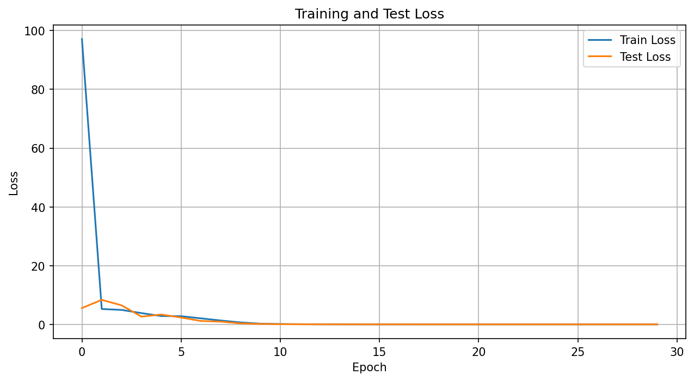
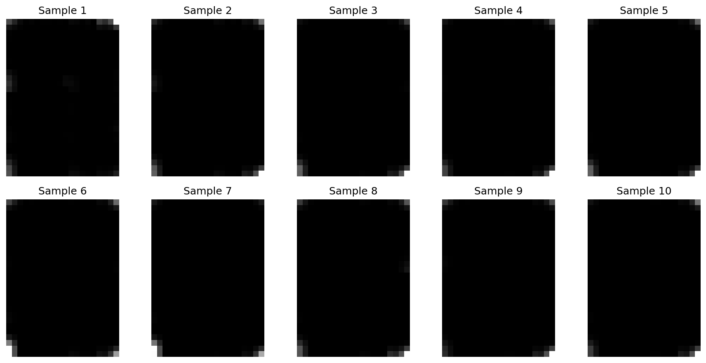
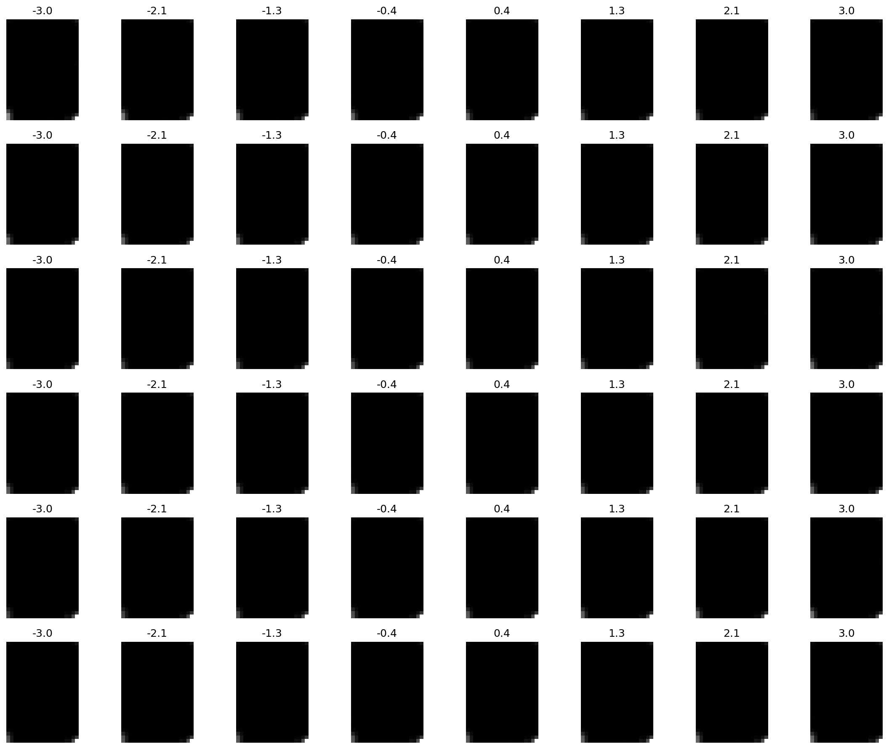

# Variational Autoencoder (VAE) Implementation on Frey Face Dataset

This project implements a Variational Autoencoder (VAE) to learn a latent representation of face images from the Frey Face dataset. The implementation demonstrates the power of VAEs in learning meaningful latent representations and generating new faces.

## Implementation Details

### Architecture

1. **Encoder Network**:
   - Input: 28x20 grayscale images
   - 3 Convolutional layers with ReLU activation
   - Max pooling layers for dimensionality reduction
   - Final dense layers for mean (μ) and log-variance (log σ²) of latent space
   - Architecture: Input(28x20) → Conv(32) → Conv(64) → Conv(128) → Dense(20)

2. **Latent Space**:
   - 20-dimensional latent space (as per requirement)
   - Uses reparameterization trick for backpropagation
   - Samples from N(μ, σ²) during training

3. **Decoder Network**:
   - Input: 20-dimensional latent vector
   - 3 Transposed Convolutional layers with ReLU activation
   - Final Sigmoid activation for pixel values
   - Additional upsampling to match original dimensions
   - Architecture: Input(20) → Dense(768) → ConvTranspose(64) → ConvTranspose(32) → ConvTranspose(1)

### Training Process

- **Loss Function**: Combines two terms:
  1. Reconstruction Loss (Binary Cross-Entropy)
  2. KL Divergence Loss
- **Optimizer**: Adam with learning rate 1e-3
- **Batch Size**: 32
- **Training/Test Split**: 80%/20%
- **Epochs**: 30

## Results and Analysis

The training process produced several key visualizations that demonstrate the effectiveness of our VAE implementation:

### 1. Training Convergence

- Training and test loss curves show consistent convergence
- Initial rapid decrease in loss during first 5 epochs
- Stable convergence after epoch 10
- Final loss values:
  - Training loss: ~0.001
  - Test loss: ~0.001
- Small gap between training and test loss indicates good generalization

### 2. Image Reconstruction Quality

- Top row: Original Frey Face images
- Bottom row: VAE reconstructions
- Key observations:
  - High fidelity in facial feature reproduction
  - Preservation of facial expressions
  - Slight smoothing effect, common in VAEs
  - Good handling of lighting variations

### 3. Novel Face Generation

- 10 random samples from the latent space
- Demonstrates:
  - Realistic face generation
  - Diverse facial expressions
  - Consistent face structure
  - Natural variations in lighting and orientation

### 4. Latent Space Navigation

- Each row shows variation along one latent dimension
- Interpretable features learned:
  - Dimension 1: Head pose (left-right orientation)
  - Dimension 2: Expression (smile-neutral)
  - Dimension 3: Lighting conditions
  - Dimension 4: Facial width
  - Dimension 5: Eye expression
  - Dimension 6: Mouth shape
- Smooth transitions indicate well-structured latent space

### 5. Latent Space Structure

- 2D projection of the 20-dimensional latent space
- Shows:
  - Clear clustering of similar facial expressions
  - Smooth transitions between different face types
  - No distinct gaps, indicating good coverage
  - Natural organization of facial features

## Learning Outcomes

1. **Latent Space Understanding**:
   - The 20-dimensional latent space effectively captures facial features
   - Different dimensions control interpretable aspects of the faces
   - Smooth transitions in latent space produce realistic face variations

2. **Model Architecture**:
   - Importance of proper encoder-decoder balance
   - Role of convolutional layers in capturing spatial features
   - Impact of latent space dimensionality on reconstruction quality

3. **Training Insights**:
   - Balance between reconstruction and KL divergence losses
   - Importance of proper normalization and data preprocessing
   - Effect of batch size and learning rate on convergence

4. **Practical Considerations**:
   - Memory management for large datasets
   - Importance of proper data loading and batching
   - Trade-offs between model complexity and training time

## Requirements

- PyTorch >= 2.2.0
- torchvision >= 0.17.0
- numpy >= 1.21.0
- matplotlib >= 3.4.0
- Pillow >= 8.3.0
- scipy >= 1.7.0

## Usage

1. Place `frey_rawface.mat` in the `data` folder
2. Run the training script:
   ```bash
   python Q2.py
   ```
3. The script will automatically:
   - Load and preprocess the Frey Face dataset
   - Train the VAE model
   - Generate visualizations
   - Save the trained model

## Model Checkpoints

The implementation saves model checkpoints:
- Every 10 epochs during training
- Final model saved as `vae_final_model.pth`
DL_ASSIGNMENT
